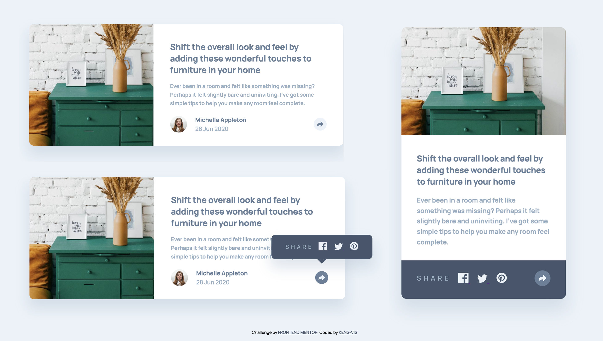
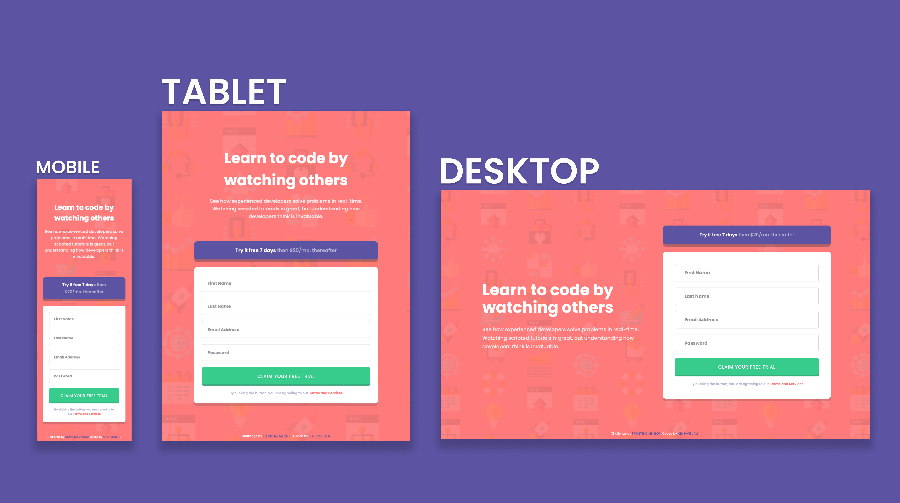
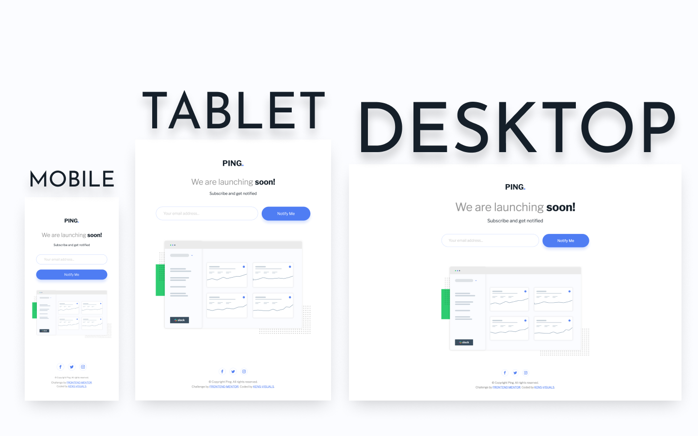
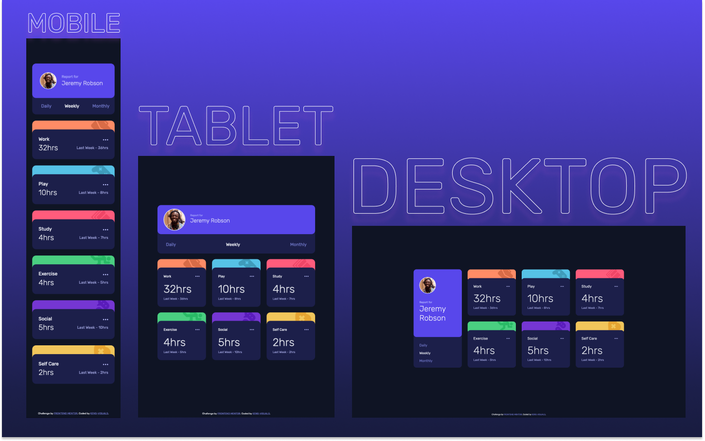
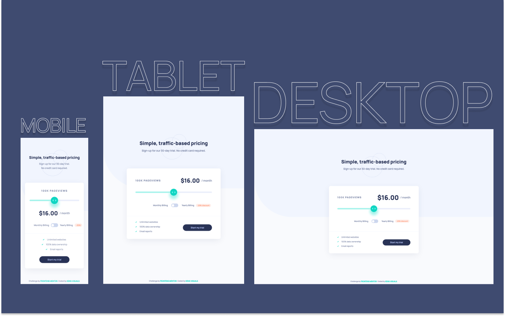

| Table of Contents                                                     |
| --------------------------------------------------------------------- |
| [Article Preview Component](#article-preview-component)               |
| [Base Apparel Coming Soon](#base-apparel-coming-soon)                 |
| [Intro Component With Signup Form](#intro-component-with-signup-form) |
| [Ping Coming Soon Page](#ping-coming-soon-page)                       |
| [Time Tracking Dashboard](#time-tracking-dashboard)                   |
| [Tip Calculator App](#tip-calculator-app)                             |
| [Crowdfunding Product Page](#crowdfunding-product-page)               |
| [Interactive Pricing Component](#interactive-pricing-component)       |

# Vanilla JS Projects

## Article Preview Component

- Live Site URL: [https://kens-visuals.github.io/article-preview-component/#](https://kens-visuals.github.io/article-preview-component/#)
- Repository URL: [https://github.com/kens-visuals/article-preview-component](https://github.com/kens-visuals/article-preview-component)
- Solution URL: [https://www.frontendmentor.io/solutions/article-preview-comp-with-bem-sass-and-vanilla-js-vtLeoLZH4](https://www.frontendmentor.io/solutions/article-preview-comp-with-bem-sass-and-vanilla-js-vtLeoLZH4)

## Base Apparel Coming Soon

- Live Site URL: [https://kens-visuals.github.io/base-apparel-coming-soon/](https://kens-visuals.github.io/base-apparel-coming-soon/)
- Repository URL: [https://github.com/kens-visuals/base-apparel-coming-soon](https://github.com/kens-visuals/base-apparel-coming-soon)
- Solution URL: [https://www.frontendmentor.io/solutions/base-apparel-coming-soon-with-vanilla-js-scss-and-bem-mbo9r7UHp](https://www.frontendmentor.io/solutions/base-apparel-coming-soon-with-vanilla-js-scss-and-bem-mbo9r7UHp)

## Intro Component With Signup Form

- Live Site URL: [https://kens-visuals.github.io/intro-component-with-signup-form/](https://kens-visuals.github.io/intro-component-with-signup-form/)
- Repository URL: [https://github.com/kens-visuals/intro-component-with-signup-form](https://github.com/kens-visuals/intro-component-with-signup-form)
- Solution URL: [https://www.frontendmentor.io/solutions/intro-comp-with-signup-form-built-with-scss-bem-and-vanilla-js-aIoqL7r_n](https://www.frontendmentor.io/solutions/intro-comp-with-signup-form-built-with-scss-bem-and-vanilla-js-aIoqL7r_n)

## Ping Coming Soon Page

- Live Site URL: [https://kens-visuals.github.io/ping-coming-soon-page/](https://kens-visuals.github.io/ping-coming-soon-page/)
- Repository URL: [https://github.com/kens-visuals/ping-coming-soon-page](https://github.com/kens-visuals/ping-coming-soon-page)
- Solution URL: [https://www.frontendmentor.io/solutions/ping-coming-soon-page-with-bem-scss-and-vanilla-js-Zoi6yA_6s](https://www.frontendmentor.io/solutions/ping-coming-soon-page-with-bem-scss-and-vanilla-js-Zoi6yA_6s)

## Time Tracking Dashboard

- Live Site URL: [https://kens-visuals.github.io/time-tracking-dashboard/](https://kens-visuals.github.io/time-tracking-dashboard/)
- Repository URL: [https://github.com/kens-visuals/time-tracking-dashboard](https://github.com/kens-visuals/time-tracking-dashboard)
- Solution URL: [https://www.frontendmentor.io/solutions/time-tracking-dashboard-with-bem-scss-and-vanilla-js--5P53ADEz](https://www.frontendmentor.io/solutions/time-tracking-dashboard-with-bem-scss-and-vanilla-js--5P53ADEz)

## Tip Calculator App

- Live Site URL: [https://kens-visuals.github.io/tip-calculator-app/](https://kens-visuals.github.io/tip-calculator-app/)
- Repository URL: [https://github.com/kens-visuals/tip-calculator-app](https://github.com/kens-visuals/tip-calculator-app)
- Solution URL: [https://www.frontendmentor.io/solutions/splitter-tip-calculator-app-with-vanilla-js-scss-and-bem-4c6nu5szo](https://www.frontendmentor.io/solutions/splitter-tip-calculator-app-with-vanilla-js-scss-and-bem-4c6nu5szo)

## Crowdfunding Product Page

- Live Site URL: [https://kens-crowdfund.netlify.app/](https://kens-crowdfund.netlify.app/)
- Repository URL: [https://github.com/kens-visuals/crowdfunding-product-page](https://github.com/kens-visuals/crowdfunding-product-page)
- Solution URL: [https://www.frontendmentor.io/solutions/crowdfunding-product-page-with-vanilla-js-scss-and-bem-TWbk3JbR1](https://www.frontendmentor.io/solutions/crowdfunding-product-page-with-vanilla-js-scss-and-bem-TWbk3JbR1)

## Interactive Pricing Component

- Live Site URL: [https://kens-visuals.github.io/interactive-pricing-component/](https://kens-visuals.github.io/interactive-pricing-component/)
- Repository URL: [https://github.com/kens-visuals/interactive-pricing-component](https://github.com/kens-visuals/interactive-pricing-component)
- Solution URL: [https://www.frontendmentor.io/solutions/interactive-pricing-component-with-vanilla-js-scss-and-bem-TKxK-gb_9](https://www.frontendmentor.io/solutions/interactive-pricing-component-with-vanilla-js-scss-and-bem-TKxK-gb_9)
